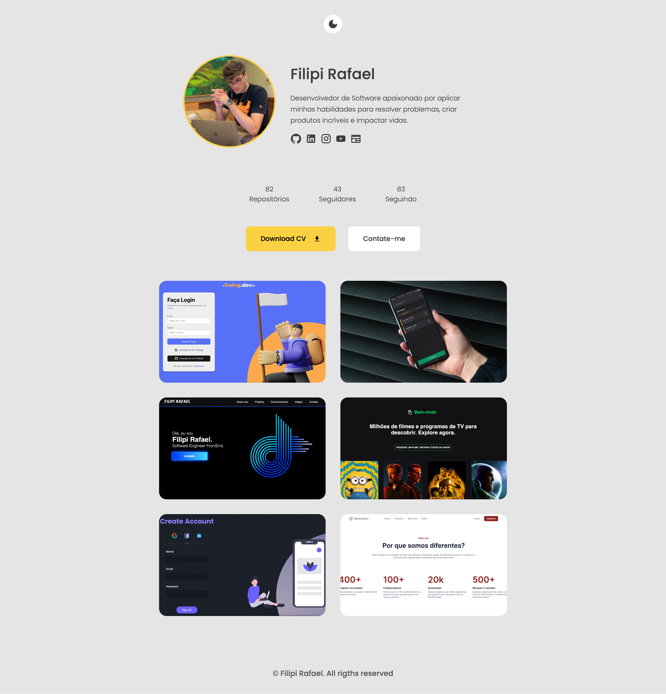
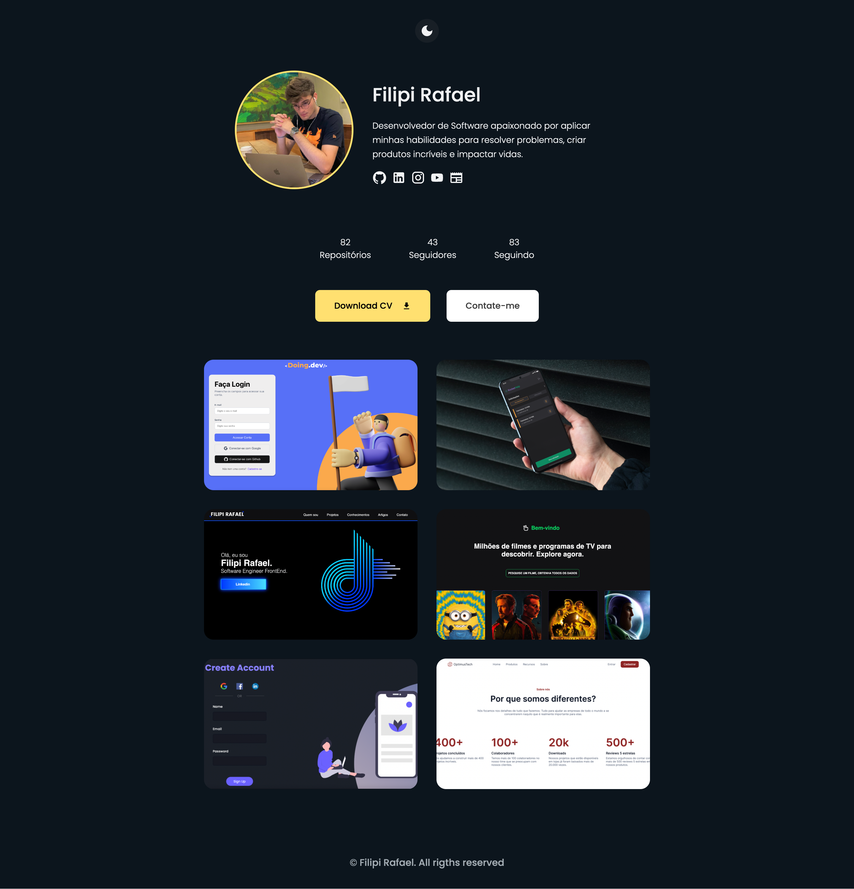

## 🚀 Sobre o Projeto

A ideia do projeto foi para aplicar, práticar e melhorar minhas habilidades técnicas em desenvolvimento web com React, além de utilizar para portfólio e apresentação profissional.

## 💡 Ideia

O projeto tem o objetivo final de ser um portfólio minimalista.

## 🚀 Live Preview

Acesse o projeto: [Live Preview](https://portfolio-github-api.vercel.app/)

## 🚀 Novas versões

Conforme vou adquirindo novas habilidades, irei atualizando o projeto em novas versões. 

## 🚀 Tecnologias utilizadas

- HTML/CSS
- Javascript
- React
- Vercel
##

